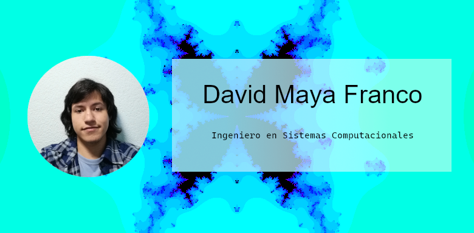

## 🔗 Links

Hello there! Soy David, un bioinformático loco, desarrollador de sistemas y profesor de desarrollo Web en Dev.F.

Actualmente algunas de mis habilidades son:
- Desarrollo e investigación en Bioinformática
- Desarrollo de IA
- Desarrollo de software y hardware
- Desarrollo de bases de datos SQL
- Enseñanza

Y como puedes ver... ¡¡¡También me encantan los fractales!!!

# 📊 GitHub Stats:

 
 

## Programming Languages:

	
	
	
	
	
    
    

<!--
**DaveWMF/DaveWMF** is a ✨ _special_ ✨ repository because its `README.md` (this file) appears on your GitHub profile.

Here are some ideas to get you started:

- 🔭 I’m currently working on ...
- 🌱 I’m currently learning ...
- 👯 I’m looking to collaborate on ...
- 🤔 I’m looking for help with ...
- 💬 Ask me about ...
- 📫 How to reach me: ...
- 😄 Pronouns: ...
- ⚡ Fun fact: ...
-->
